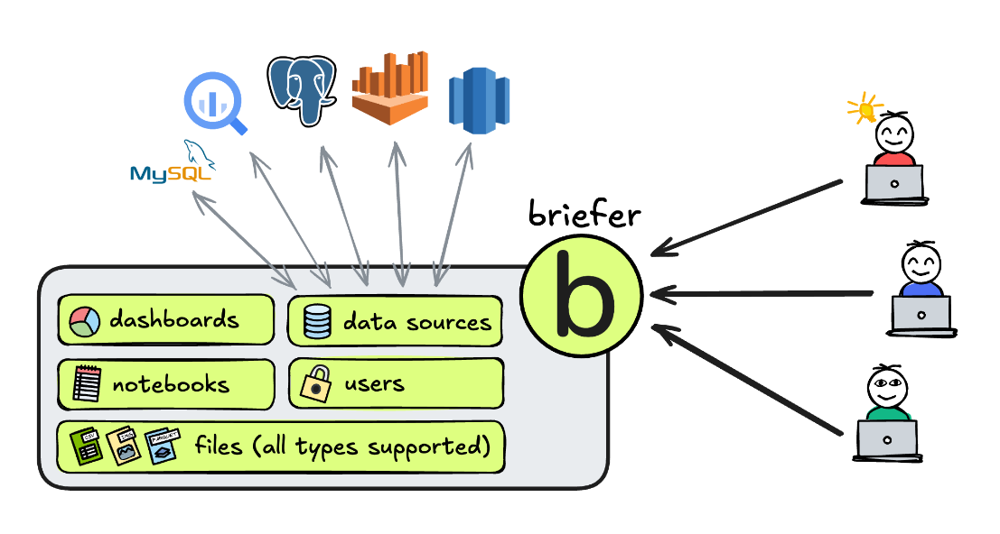
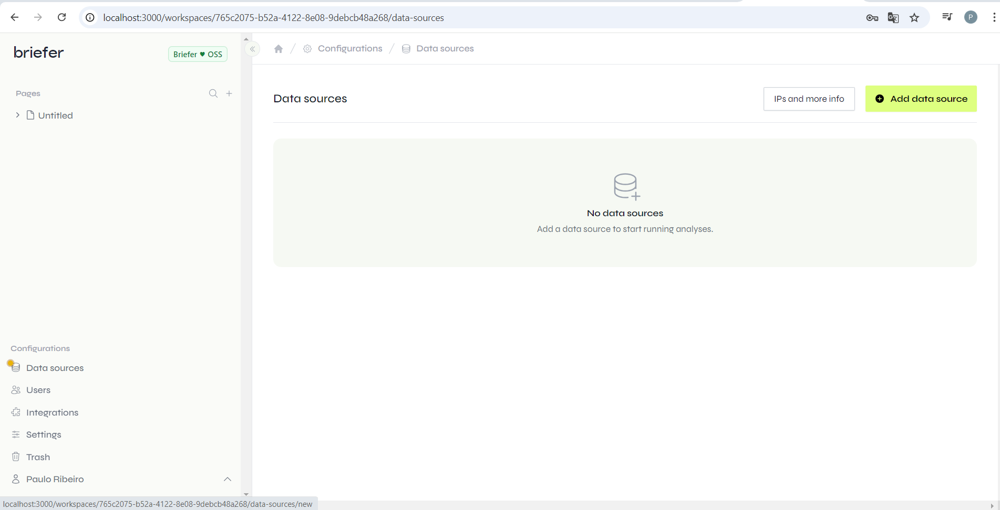
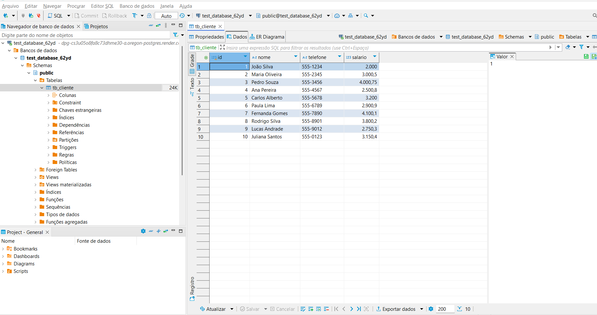
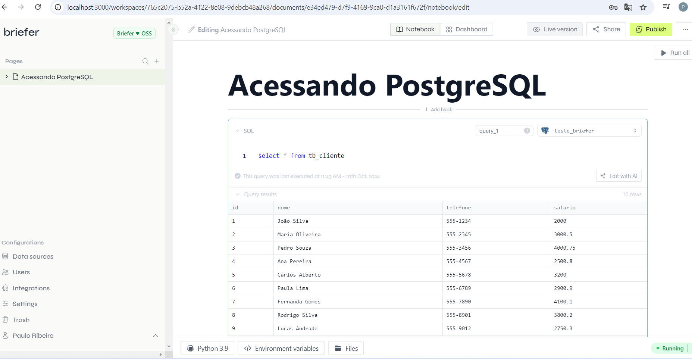

# Quick Start
The recommended way to run Briefer locally is to install it using pip and run it using the briefer command. Please note that Briefer requires Docker to run, so make sure you have it installed before running the commands below.

# Install Briefer
pip install briefer

# Run Briefer and access it on http://localhost:3000
briefer
If you run Briefer using pip, our initialization scripts will take care of downloading our docker image, setting up volumes to store Briefer's data, and starting the application.

Alternatively, you can also run Briefer using Docker directly:

# Run Briefer using Docker
docker run -d \
  -p 3000:3000 \
  -v briefer_psql_data:/var/lib/postgresql/data \
  -v briefer_jupyter_data:/home/jupyteruser \
  -v briefer_briefer_data:/home/briefer \
  briefercloud/briefer
When running on Windows' PowerShell, it might be necessary to add an extra ` to the end of each line instead of the \, like this:

# Run Briefer using Docker
docker run -d `
  -p 3000:3000 `
  -v briefer_psql_data:/var/lib/postgresql/data `
  -v briefer_jupyter_data:/home/jupyteruser `
  -v briefer_briefer_data:/home/briefer `
  briefercloud/briefer
These volumes are for Briefer to store its data, including its pages, dashboards, schedules, and users. If you want to remove Briefer's data, you can remove these volumes.

For more information on how to deploy Briefer in production, please refer to our deployment guide.

If you want to contribute to Briefer, please read our contributing guide which explains how run Briefer in development mode.

How do I use Briefer?
Briefer is a collaborative web application. Each instance of Briefer can have multiple users who share a workspace containing multiple pages.

Ideally, you'll deploy Briefer somewhere where your team can access it, like a server or a cloud provider. Once you have Briefer running, you can access it on your browser and start creating pages.

To fetch external data in Briefer, you can connect it to your databases, like PostgreSQL, BigQuery, Redshift, Athena, or MySQL. You can also upload any types of files and work with them as if they were on disk.

Briefer usage diagram

# Acessando do meu notebook 

# Banco de dados criado no PostGreSql

 # Acessando PostGreSql pelo Briefer

    

 